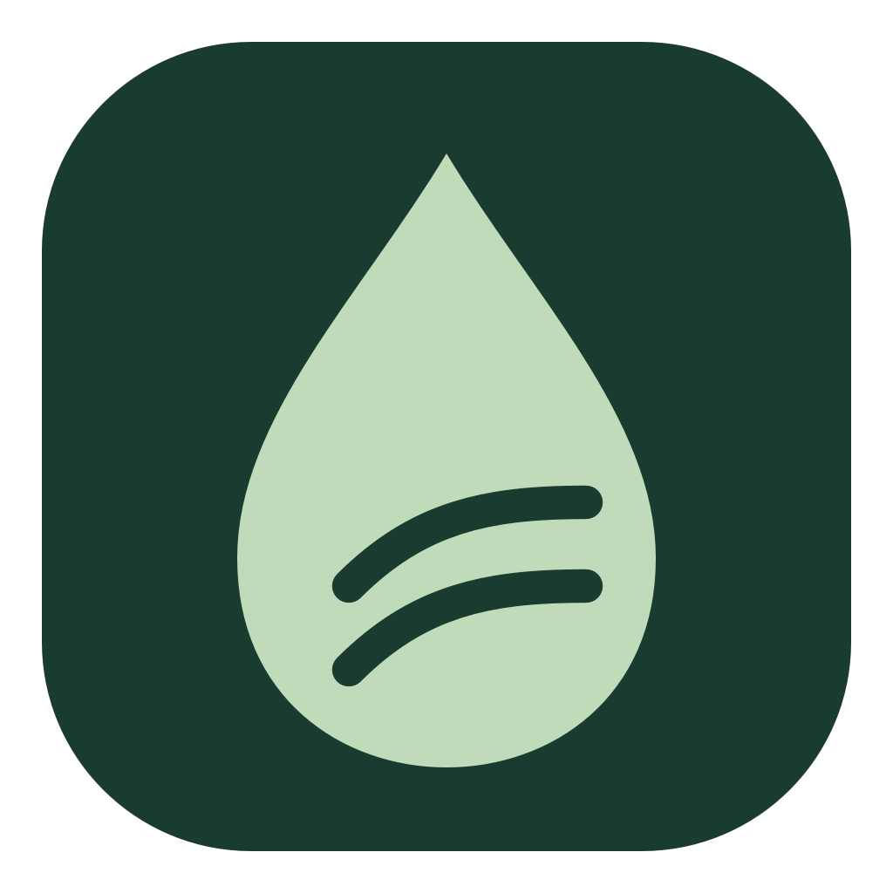

<p align="center">
  
</p>

<h1 align="center">Seagreen</h1>
<p align="center"><strong>A lighter footprint. A clearer picture.</strong></p>
<p align="center">Thoughtful tools for understanding your computer.<br>Observe your workloads, measure changes, and make every adjustment count.</p>
<p align="center">
  <a href="https://github.com/serene-interactive/Seagreen/releases/latest">Download Seagreen</a> ·
  <a href="#windows--web-ui">Windows & web UI</a> ·
  <a href="#terminal">Terminal</a> ·
  <a href="https://sereneinteractive.com">By Serene Interactive</a>
</p>

[](https://sereneinteractive.com)
[](LICENSE)

## A considered workspace

- Native SwiftUI app for macOS 13+, with a menu-bar monitor.
- Redesigned local web UI for Windows, Linux, and macOS.
- Live CPU, resident memory, and disk I/O counters.
- Supported power sources, explicit scope, and missing-data coverage.
- Local recordings, workload comparisons, and CSV/JSON exports.
- An efficiency launcher for explicitly selected background jobs.
- Quit and confirmed Force Quit controls, with protected-process checks.

No account, telemetry, remote UI assets, or administrator access for ordinary monitoring.

## macOS

Download the macOS ZIP or DMG from [Releases](https://github.com/serene-interactive/Seagreen/releases), then move **Seagreen.app** into Applications. Python is not required. Universal packages support Apple silicon and Intel Macs running macOS 13 or later.

Local builds are ad-hoc signed, not Apple-notarized. macOS may require an explicit **Open Anyway** action in Privacy & Security.

## Windows / web UI

Install Python, download or clone this repository, then run:

```bash
python -m pip install .
python -m seagreen web
```

On Windows, you can also double-click **Launch Seagreen.cmd**. It creates a local virtual environment, installs the package, and opens the dashboard. The initial install needs an internet connection for Python dependencies.

Keep the terminal open. The dashboard binds only to `127.0.0.1` and opens with a private per-launch token. If port 8080 is occupied:

```bash
seagreen web --port 8081
```

## Updating

Use **Get Updates** in the Mac app’s Seagreen menu or the web UI to open the latest GitHub release. Updates are installed manually.

On macOS, quit Seagreen and replace the app in Applications with the latest download. Local recordings remain in place. On Windows, stop the monitor, download the updated source (or run `git pull` in your clone), then run **Launch Seagreen.cmd** again. For a manual Python install, run `python -m pip install --upgrade .` from the updated source folder and restart the monitor.

Application rows stay in place while live values update. Use **Refresh list** or change the sort selection to reorder them and clear stopped processes. CPU hues indicate activity, not measured energy use.

## Terminal

```bash
seagreen                  # interactive slash commands
seagreen list python
seagreen monitor --pid 1234 --duration 60
```

`/list`, `/track`, `/web`, `/gui`, `/agents`, `/help`, and `/quit` remain available. Use `/stop <pid>` to request quit or `/kill <pid>` to force quit, with confirmation. Shell commands `seagreen stop <pid>` and `seagreen kill <pid>` work too. Background scheduling is in the explicit job launcher. Legacy estimate APIs remain in `tracker.py` for compatibility; the v3 interfaces do not use them.

## Measurement

Power availability depends on hardware and permissions. Windows web monitoring currently reports resources without inventing wattage. Supported Linux systems can expose RAPL CPU-package counters. The native Mac app can read battery discharge on supported MacBooks and optionally watch an Apple `powermetrics` plist file.

Power readings always identify their scope. There is no guessed per-app wattage or carbon score. Savings comparisons require matching devices and sources, completed-work units, and at least 90% power coverage. See [measurement details](docs/measurement.md).

## Build & test

```bash
python -m unittest discover -s tests -v
bash desktop/scripts/build.sh
bash desktop/scripts/test.sh
ARCH=x86_64 bash desktop/scripts/build.sh
bash desktop/scripts/package.sh
```

macOS builds require matching Apple Command Line Tools and SDK versions. `SDKROOT` can select an installed compatible SDK. Every build creates a fresh app bundle under `desktop/build/apps/`; it never overwrites an open app. ZIP/DMG packages are created under `desktop/build/releases/`.

[MIT](LICENSE) · [Serene Interactive](https://sereneinteractive.com)
